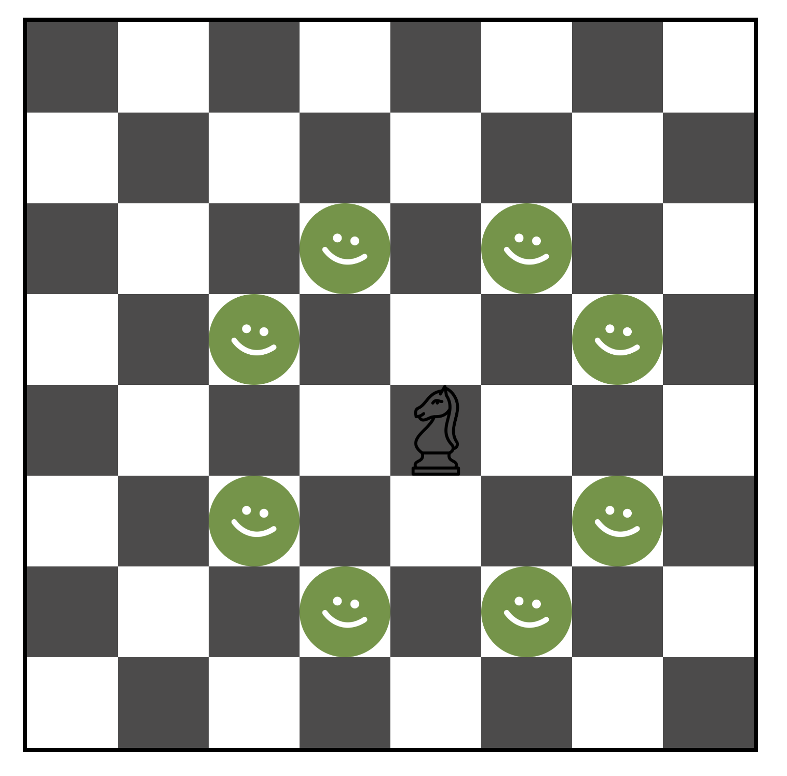
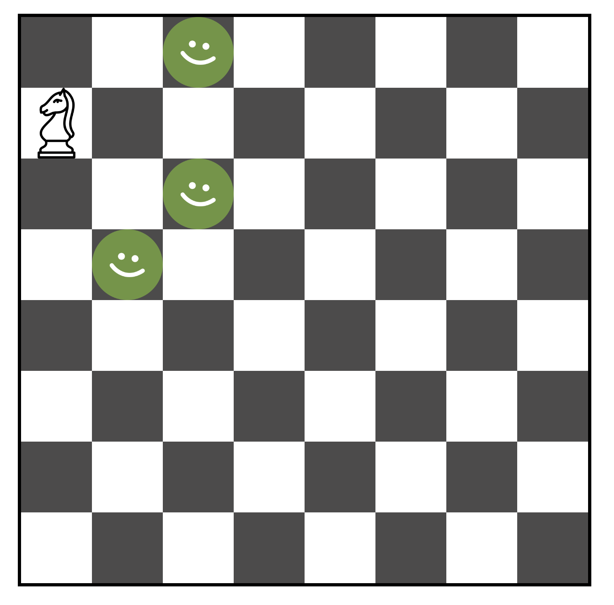

# Chess-task
***
## Task discription
1. You will need to create a chessboard.
2. You will also need to write code that will display the knight on the field that the user clicked on.
3. Plus, display which fields he can move the figure to.
***
### Examples:

